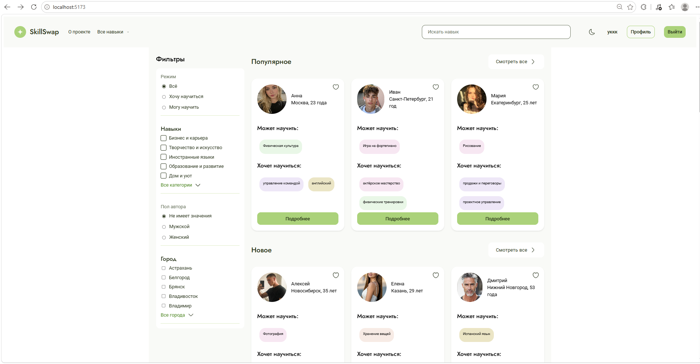

# SkillSwap

SPA-платформа для поиска партнеров и взаимного обучения, где пользователи могут бесплатно обмениваться профессиональными навыками и знаниями.



**Стек:** `React` · `TypeScript` · `CSS Modules` · `clsx` · `LocalStorage` · `Mock API` · `Git`

---
## Ключевые фичи

- Поиск партнёров по навыкам с фильтрацией по категориям и городам
- Система избранного для сохранения интересных профилей
- Пошаговая регистрация (3 шага) с валидацией данных
- Личный кабинет с редактированием профиля и списка навыков

---

## Мой вклад в проект

### Архитектура данных, Mock API и TypeScript-типизация

- Спроектировала и подготовила структуру JSON-моков (`users.json`, `skills.json`) в соответствии с бизнес-логикой и макетами.
- Подготовила базу изображений и аватарок.
- Разработала систему типов и интерфейсов для проекта, включая `User`, `UserCard`, `SkillTeach`, `Subcategory`, `Category`, чтобы обеспечить безопасную работу с данными.
- Реализовала универсальную функцию `loadJson<T>`, которая инкапсулирует `fetch` и обрабатывает ошибки.
- На основе этого создала модульный API-слой:
  - `citiesApi` — загрузка городов;
  - `favoritesApi` — работа с избранными пользователями;
  - `skillsApi` — категории и подкатегории навыков;
  - `usersApi` — получение списка всех пользователей.

### Глобальное состояние, аутентификация и оптимизация

- Реализовала MVP-аутентификацию на базе `AuthProvider` и кастомного хука `useAuth`.
- Настроила сохранение и восстановление сессии пользователя в `localStorage`.
- Интегрировала форму `LogInForm` в систему авторизации.
- Разработала `CatalogSearchProvider` и контекст для синхронизации поиска между шапкой сайта и страницей каталога.
- Подключила `useDebounce` с задержкой `300–400 мс` для оптимизации ввода в поисковой строке и снижения количества лишних перерендеров.
- Интегрировала кастомный хук `useCatalogItems` на страницу `CatalogPage`, сделав его единым источником данных (`Single Source of Truth`) для отображения элементов и состояния загрузки.

### Компонентная база и стилизация

- Настроила поддержку CSS-модулей в проекте и внедрила `clsx` для удобного управления классами.
- Создала переиспользуемую кнопку `LikeButton` с поддержкой статического состояния через проп `isLiked` и плавной анимацией при клике.
- Разработала универсальный компонент `Tag` для подкатегорий.
- Реализовала 7 визуальных вариантов отображения тегов: `business`, `creative`, `languages`, `home`, `education`, `health`, `other`.
- Перенесла дизайн-токены макета в код, настроив глобальные CSS-переменные для цветов (фон, текст, акценты, границы, ошибки).

### Инфраструктура и командная работа

- Провела базовую оптимизацию проекта и устранила уязвимости с помощью `npm audit fix`.
- Участвовала в согласовании контрактов данных с тимлидом.
- Вела задачи в GitHub Issues.
- Принимала участие в code review и финальной интеграции функционала.

---
## Архитектура проекта

Проект спроектирован на основе методологии **Feature-Sliced Design (FSD)**:

| Слой | Назначение | Примеры |
|------|------------|---------|
| `app` | Инициализация приложения, роутинг, глобальные стили и провайдеры | `main.tsx`, `providers/`, `styles/` |
| `api` | Endpoint-слой для работы с данными (моки/реальные API) | `users.ts`, `skills.ts` |
| `entities` | Доменные бизнес-сущности и типы | `user/`, `skill/`, `category/` |
| `features` | Пользовательские сценарии и интеракции | `auth/`, `search/`, `favorites/`, `requests/` |
| `widgets` | Крупные композиционные UI-блоки | `Header/`, `Sidebar/`, `Footer/` |
| `pages` | Страницы приложения и route-level компоненты | `CatalogPage/`, `ProfilePage/`, `AuthPages/` |
| `shared` | Переиспользуемый UI-кит, хуки, утилиты, конфиги | `ui/`, `hooks/`, `lib/`, `constants/` |

---
## Данные

Основные моки:

- `public/db/users.json`
- `public/db/skills.json`

## Роуты

- `/`, `/catalog` — каталог
- `/skill/:id` — страница навыка
- `/profile`, `/user/:id` — профиль
- `/favorites` — избранное
- `/login`, `/register`, `/register/step2`, `/register/step3` — auth flow
- `/about`, `/contacts`, `/blog`, `/terms`, `/privacy` — статические страницы
- `*` — 404


## Установка и запуск

1. **Установка зависимостей:**
   ```bash
   npm ci
   ```

2. **Запуск dev-сервера:**
   ```bash
   npm run dev
   ```
   Приложение откроется по адресу `http://localhost:5173/`.

3. **Сборка проекта:**
   ```bash
   npm run build
   ```
   
4. **Проверка**
    ```bash
    npm run lint
    npm run format:check
    npm run lint:css
    ```
